# 低成本短信转发器

> 本仓库基于 [chenxuuu/sms_forwarding](https://github.com/chenxuuu/sms_forwarding) 复刻修改，保留原短信转发能力，并增加主动配网、备用 WiFi、定时发送、状态快照、远程短信、来电提醒等功能。

[后台页面演示](https://sms.j2.cx/)

本项目旨在使用低成本的硬件设备，实现短信自动转发、网页管理、远程发送短信和在线状态通知，支持多种推送方式同时启用。

> 视频教程：[B站视频](https://www.bilibili.com/video/BV1cSmABYEiX)


## 功能

- **短信转发**：收到短信后转发到已启用的推送通道和邮箱通道。
- **来电提醒**：收到来电后推送来电号码、归属地、本机号码和响铃时长。
- **中文通知模板**：短信、来电、系统通知均使用中文模板，时间格式为 `2026年7月5日 14:56:00`。
- **本机号码管理**：可在网页或管理员短信中设置本机号码；保存本机号码时会尝试写入 SIM 卡本机号码；开机/首次识别 SIM 后会尝试从 SIM 卡读取本机号码并保存。
- **内置手机号归属地库**：基于 [dannyhu926/phone_location](https://github.com/dannyhu926/phone_location) 生成 ESP32 可查的压缩归属地表，来电/来信可显示省市和运营商。
- **国外号码国别识别**：国外号码按国家显示，如 `美国`、`日本`、`韩国`、`英国`。
- **网页管理后台**：支持浏览器配置账号、WiFi、邮箱、推送通道、管理员号码、黑名单、定时短信、状态快照等。
- **主动配网**：WiFi 连接失败时自动开启 ESP32 AP 热点，手机连接热点后可进入管理页面配置 WiFi。
- **三组 WiFi**：支持 WiFi1、WiFi2、WiFi3 顺序连接；无密码 WiFi 可留空密码。
- **多邮箱通道**：支持 3 个完全独立 SMTP 邮件通道，每个通道可填写多个接收邮箱。
- **多推送通道**：支持最多 5 个推送通道同时启用，每个通道可独立选择 POST JSON、Bark、GET、钉钉、PushPlus、Server酱、自定义、飞书、Gotify、Telegram。
- **PushPlus 群组推送**：PushPlus 可填写群组名称/编码，直接推送到群组。
- **推送优先发送**：系统通知、短信通知、来电通知均优先发送推送通道，推送完成后再发送邮件，避免 SMTP 邮件连接慢拖延手机推送。
- **推送失败重试**：单个推送通道失败后立即继续下一个通道，所有通道尝试完成后再对失败通道重试 3 次。
- **网页发送短信**：可通过管理页面主动发送短信。
- **管理员远程短信**：管理员可通过统一 `配置：` 短信格式远程发送短信、修改本机号码、WiFi、推送通道、邮箱通道、定时短信、状态快照、号码黑名单，并可查询系统参数。
- **管理员白名单**：最多 10 个管理员号码可执行远程短信指令。
- **号码黑名单**：黑名单号码发来的短信会被忽略，不转发、不发邮件、不推送。
- **定时发送短信**：支持每天/每周/每月定时发送短信；短信内容留空时发送系统概览。
- **状态快照**：支持每天/每周/每月定时通过推送通道发送状态快照，不发送短信。
- **长短信分段处理**：长短信分段 5 秒内收齐只推送完整合并版；未收齐时推送已收到分段并标注可能不完整，后续收齐后再推送完整合并版。
- **模组诊断**：支持固件信息、信号质量、SIM 卡信息、网络状态、WiFi 状态查询。
- **模组控制**：支持模组软重启、硬重启、信号查询、运营商查询、IMEI 查询、飞行模式切换。
- **AT 指令终端**：网页内置 AT 终端，可直接调试模组 AT 指令。
- **系统日志**：网页可查看设备运行日志。
- **后台模组初始化**：网页先启动，启动约 8 秒后初始化模组；未插 SIM 或未注册时不影响管理页面使用。
- **Huge APP 分区适配**：内置完整归属地库后必须使用 `Huge APP (3MB No OTA/1MB SPIFFS)` 分区。

### 远程短信格式

只有“管理员号码”列表中的手机号可以执行远程指令。管理员号码最多支持 10 个，每行填写一个手机号；发送方号码带不带 `+86` 都会做兼容匹配。

所有远程配置短信必须以 `配置：` 或 `CONFIG` 开头，避免普通短信误触发。配置成功或失败后，设备都会发送系统通知，通知内容会写清楚本次修改了什么。

#### 管理员短信指令完整说明

| 指令 | 格式 | 作用 | 备注 |
|---|---|---|---|
| **远程发送短信** | `配置：` + `短信收件人：号码` + `短信内容：内容` | 让设备向指定号码发送短信 | 目前只保留这一种远程发短信格式 |
| **远程配置** | `配置：` 开头的多行配置 | 修改本机号码、WiFi、邮箱、推送通道、定时任务、黑名单等 | 只有管理员号码可执行 |
| **远程查询系统参数** | `配置：查询系统参数` | 查询设备能读取到的系统和配置参数 | 会返回敏感配置，仅限可信管理员使用 |
| **远程重启** | `RESET` | 重启模组并重启 ESP32 | 必须全部大写 |

#### 一次性修改多个参数

一条管理员短信可以同时修改多个配置项。格式仍然是第一行写 `配置：`，后面每行写一个 `字段名：内容`。例如同时修改本机号码、WiFi、PushPlus 和邮箱通道：

```text
配置：
本机号码：13900000000
WIFI序号：1
WIFI名称：示例WiFi
WIFI密码：示例密码12345678
推送序号：1
推送类型：PushPlus
通道名称：我的PushPlus
Token：你的pushplus_token
群组：示例群组
启用：是
邮箱序号：1
SMTP服务器：smtp.qq.com
SMTP端口：465
发送邮箱账号：example@qq.com
密码：邮箱授权码
接收邮件地址：example@qq.com,example@qq.com
```

注意：同一种配置如果要同时修改多个槽位，例如推送通道 1 和推送通道 2，建议分两条短信发送；一条短信里只有一个 `推送序号`、`邮箱序号`、`WIFI序号` 会作为当前操作槽位。远程发送短信使用 `短信收件人` 和 `短信内容` 时会优先执行发送短信，不建议和其它配置混在同一条短信里。

#### 远程发送短信

```text
配置：
短信收件人：13900000000
短信内容：查询话费
```

#### 修改本机号码

手动设置本机号码；保存后会尝试写入 SIM 卡本机号码：

```text
配置：
本机号码：13900000000
```

尝试从 SIM 卡读取本机号码并保存：

```text
配置：
本机号码：自动
```

备注：不是所有 SIM 卡都会保存本机号码，也不是所有模组/SIM 都支持写入本机号码；失败时系统会保留本机配置号码。

#### 添加、修改或删除 WiFi

自动写入空闲 WiFi 位；如果 1/2/3 都已有，会默认覆盖 WiFi1：

```text
配置：
WIFI名称：示例WiFi
WIFI密码：示例密码12345678
```

指定修改 WiFi1、WiFi2 或 WiFi3：

```text
配置：
WIFI序号：1
WIFI名称：示例WiFi
WIFI密码：示例密码12345678
```

删除 WiFi2：

```text
配置：
WIFI序号：2
WIFI操作：删除
```

#### 添加、修改或删除邮箱通道

邮箱序号可选：`1`、`2`、`3`。

```text
配置：
邮箱序号：1
SMTP服务器：smtp.qq.com
SMTP端口：465
发送邮箱账号：example@qq.com
密码：邮箱授权码
接收邮件地址：example@qq.com,example@qq.com
```

删除邮箱通道 2：

```text
配置：
邮箱序号：2
邮箱操作：删除
```

#### 添加、修改或删除推送通道

推送序号可选：`1`、`2`、`3`、`4`、`5`。`启用` 可填 `是/否`、`开启/关闭`、`1/0`。

POST JSON 示例：

```text
配置：
推送序号：1
推送类型：POST JSON
通道名称：我的POST
推送URL：https://example.com/sms
启用：是
```

Bark 示例：

```text
配置：
推送序号：1
推送类型：Bark
通道名称：我的Bark
推送URL：https://api.day.app/你的key
启用：是
```

GET 示例：

```text
配置：
推送序号：1
推送类型：GET
通道名称：我的GET
推送URL：https://example.com/push
启用：是
```

钉钉机器人示例：

```text
配置：
推送序号：1
推送类型：钉钉
通道名称：钉钉群
推送URL：https://oapi.dingtalk.com/robot/send?access_token=xxx
Secret：SECxxxxxxxx
启用：是
```

PushPlus 示例；`群组` 可留空，留空则推送给自己：

```text
配置：
推送序号：1
推送类型：PushPlus
通道名称：我的PushPlus
Token：你的pushplus_token
群组：群组名称
启用：是
```

Server酱 示例：

```text
配置：
推送序号：1
推送类型：Server酱
通道名称：我的Server酱
Token：你的SendKey
启用：是
```

自定义模板示例；`请求体` 可使用 `{sender}`、`{message}`、`{timestamp}` 占位符：

```text
配置：
推送序号：1
推送类型：自定义
通道名称：自定义接口
推送URL：https://example.com/custom
请求体：{"sender":"{sender}","message":"{message}","timestamp":"{timestamp}"}
启用：是
```

飞书机器人示例：

```text
配置：
推送序号：1
推送类型：飞书
通道名称：飞书群
推送URL：https://open.feishu.cn/open-apis/bot/v2/hook/xxx
Secret：可选secret
启用：是
```

Gotify 示例：

```text
配置：
推送序号：1
推送类型：Gotify
通道名称：Gotify
推送URL：https://gotify.example.com
Token：你的Gotify应用Token
启用：是
```

Telegram 示例：

```text
配置：
推送序号：1
推送类型：Telegram
通道名称：Telegram
推送URL：https://api.telegram.org
ChatID：123456789
BotToken：示例BotToken
启用：是
```

删除推送通道 1：

```text
配置：
推送序号：1
推送操作：删除
```

#### 设置或删除定时短信

`周期` 可选：`每天`、`每周`、`每月`。每周可加 `星期：1-7`，每月可加 `日期：1-31`。短信内容留空时发送系统概览。

```text
配置：
定时短信：开启
周期：每天
时间：09:30
号码：13900000000
内容：查询话费
```

每周示例：

```text
配置：
定时短信：开启
周期：每周
星期：1
时间：09:30
号码：13900000000
内容：查询话费
```

删除定时短信：

```text
配置：
定时短信操作：删除
```

#### 设置或删除状态快照

`周期` 可选：`每天`、`每周`、`每月`。状态快照只走推送通道，不发送短信；内容留空时发送系统概览。

```text
配置：
状态快照：开启
周期：每天
时间：09:00
内容：
```

删除状态快照：

```text
配置：
状态快照操作：删除
```

#### 设置号码黑名单

添加黑名单号码：

```text
配置：
黑名单号码：13900000000
```

删除黑名单号码：

```text
配置：
黑名单操作：删除
黑名单号码：13900000000
```

清空黑名单：

```text
配置：
黑名单操作：清空
```

#### 查询系统参数

```text
配置：查询系统参数
```

返回内容包含管理地址、本机号码、管理员号码、推送通道、WiFi、IP、信号、可用内存、运行时长、模组状态、WiFi 配置、邮箱通道、推送通道、定时短信、状态快照等。

#### 管理员和黑名单备注

- **管理员号码**：只有管理员号码发送的远程指令才会执行；非管理员发送同样内容会按普通短信处理或转发。
- **号码黑名单**：黑名单号码发来的短信会被直接忽略，不转发、不发邮件、不走推送通道。
- **命令结果通知**：远程发送短信成功/失败、远程重启等管理员操作会通过已配置的通知通道推送结果。
- **查询参数提醒**：`配置：查询系统参数` 会返回保存的 WiFi 密码、邮箱授权码、推送 Token 等敏感配置，只允许可信管理员使用。
- **安全建议**：管理员号码不要填写无关号码；如果 SIM 卡可能被他人知道号码，建议只保留必要管理员。
## 推送通道支持

支持以下推送方式，可同时启用多个通道：

| 推送方式 | 说明 | 需要配置 |
|---------|------|---------|
| **POST JSON** | 通用HTTP POST | URL |
| **Bark** | iOS推送服务 | Bark服务器URL |
| **GET请求** | URL参数方式 | URL |
| **钉钉机器人** | 企业群通知 | Webhook URL，可选Secret加签 |
| **PushPlus** | 微信公众号推送 | Token |
| **Server酱** | 微信推送服务 | SendKey |
| **自定义模板** | 灵活的JSON模板 | URL + 请求体模板 |
| **飞书机器人** | 自定义通知 | Webhook URL |
| **Gotify** | 自建推送服务 | URL + Token |
| **Telegram Bot** | Telegram Bot 推送 | Chat ID + Bot Token |

### 推送格式说明

- **POST JSON**: `{"sender":"发送者号码","message":"短信内容","timestamp":"时间戳"}`
- **Bark**: `{"title":"发送者号码","body":"短信内容"}`
- **GET请求**: `URL?sender=xxx&message=xxx&timestamp=xxx`（自动URL编码）
- **钉钉机器人**: 文本消息格式，支持加签验证
- **PushPlus**: 使用Token推送，支持HTML格式
- **Server酱**: 使用SendKey推送，支持Markdown格式
- **自定义模板**: 使用`{sender}`、`{message}`、`{timestamp}`占位符
- **飞书机器人**: 文本消息格式，支持加签验证
- **Gotify**: 使用 Token 推送到 Gotify 服务
- **Telegram Bot**: 使用 Chat ID 和 Bot Token 推送
- **PushPlus 群组**: 参数2可填写群组名称/编码，留空则推送给自己

|状态信息|主动ping|
|-|-|
|||

## 硬件搭配

若没有焊接能力，希望直接使用成品，可选直接购以下套件（我看过了，和自己做的成本一样）  
支持**移动/联通/电信卡**：

- [小蓝鲸WIFI短信宝](https://item.taobao.com/item.htm?id=1003711355912)（找客服问）
- [4G FPC天线](https://item.taobao.com/item.htm?id=1003711355912&skuId=6162872574943)，与开发板同购

如果希望自行焊接硬件，参考下面的硬件搭配，总成本约¥27.8（会有浮动，可按实际自行组合搭配）  
仅支持**移动/联通卡**：

- ESP32C3开发板，实测选用[ESP32C3 Super Mini](https://item.taobao.com/item.htm?id=852057780489&skuId=5813710390565)，¥9.5包邮
- ML307R-DC开发板，实测选用[小蓝鲸ML307R-DC核心板](https://item.taobao.com/item.htm?id=797466121802&skuId=5722077108045)，¥16.3包邮
- [4G FPC天线](https://item.taobao.com/item.htm?id=797466121802&skuId=5722077108045)，¥2，与核心板同购


## 硬件连接

ESP32C3 与 ML307R-DC 通过串口（UART）连接，接线如下：

```
┌───────────────────────────────────────────────┐
|                                               |
|   ESP32C3 Super Mini      ML307R-DC核心板     |
| ┌───────────────────┐    ┌─────────────────┐ |
└─┼─ GPIO5 (MODEM_EN) │    │                 │ |
  │       GPIO3 (TX) ─┼───►│ RX              │ |
  │                   │    │             EN ─┼─┘
  │       GPIO4 (RX) ◄┼────┤ TX              │ 
  │                   │    │                 │ 
  │              GND ─┼────┤ GND             │ 
  │                   │    │                 │ 
  │               5V ─┼────┤ VCC (5V)        |
  │                   │    │                 │
  └───────────────────┘    └─────────────────┘
                           │                 │
                           │  SIM卡槽        │
                           │  (插入Nano SIM) │
                           │                 │
                           │  天线接口       │
                           │  (连接4G天线)   │
                           └─────────────────┘
```

可通过USB连接ESP32C3进行编程和供电，正常工作时，可通过网页与模组进行AT通信，方便调试。

## 软件组成

- ESP32C3运行自己的`Arduino`固件，负责连接WiFi和接收ML307R-DC发送过来的短信数据，然后转发到指定HTTP接口或邮箱
- ML307R-DC运行默认的AT固件，不用动

需要在`Arduino IDE`中单独安装这些库：

- **ReadyMail** by Mobizt
- **pdulib** by David Henry

需要在`Arduino IDE`中安装ESP32开发板支持，参考[官方文档](https://docs.espressif.com/projects/arduino-esp32/en/latest/installing.html)，版型选`MakerGO ESP32 C3 SuperMini`。

## Arduino IDE 烧录设置

### 安装 IDE 前期准备

1. 在 Windows 商店下载并安装 `Arduino IDE 2`
2. 打开 Arduino IDE 2，点击界面最左侧一列的 `开发板管理器`，搜索并安装 `esp32 by Espressif Systems`
3. 点击界面最左侧一列的 `库管理`，搜索并安装 `ReadyMail by Mobizt` 和 `pdulib by David Henry`

在 Arduino IDE 顶部菜单依次进入 `工具`，按下面设置：

| 设置项 | 选择值 | 为什么这样设置 |
|---|---|---|
| 开发板 | `MakerGO ESP32 C3 SuperMini` | 当前代码按这块 ESP32-C3 SuperMini 的引脚和板卡定义适配 |
| Partition Scheme | `Huge APP (3MB No OTA/1MB SPIFFS)` | 固件功能较多，默认 1.2MB APP 分区空间很紧；本项目升级通常是 USB 重新烧录，不依赖 OTA |
| Erase All Flash Before Sketch Upload | `Disabled` | 避免每次烧录清空已保存的 WiFi、推送通道、账号等配置 |
| USB CDC On Boot | `Enabled` | 方便通过 USB 串口查看启动日志和调试输出 |
| Upload Speed | `921600` | 烧录速度更快；如果烧录失败，再临时降到 `115200` |

注意：如果切换过 `Partition Scheme` 后出现异常，建议第一次切换时可临时选择 `Erase All Flash Before Sketch Upload: Enabled` 完整刷一次；刷完后再改回 `Disabled`，避免后续配置被清空。

## 网站截图

以下截图为本地模拟管理页面生成，用于展示页面结构；实际设备中的 IP、号码、WiFi、推送通道等内容会按你的真实配置显示。

### 使用说明

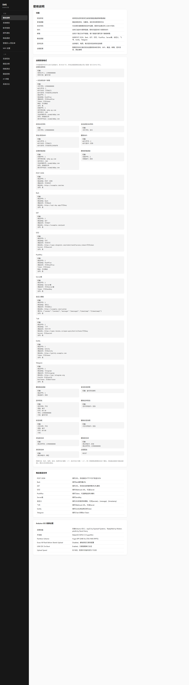

### 系统概览

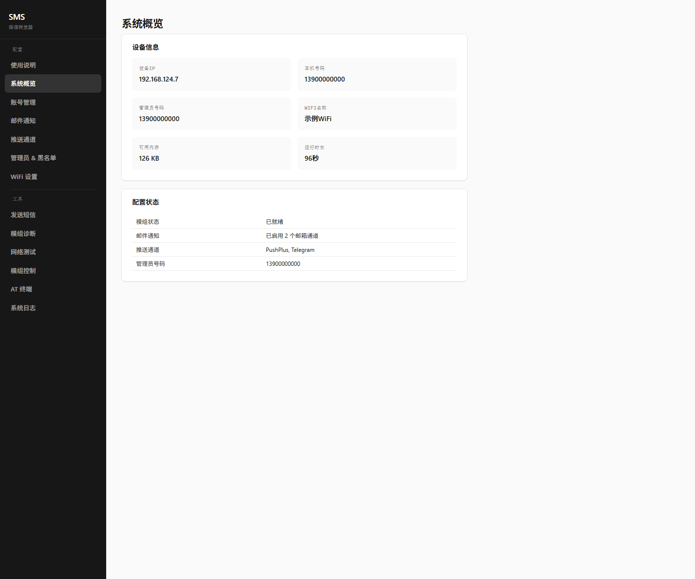

### 账号管理

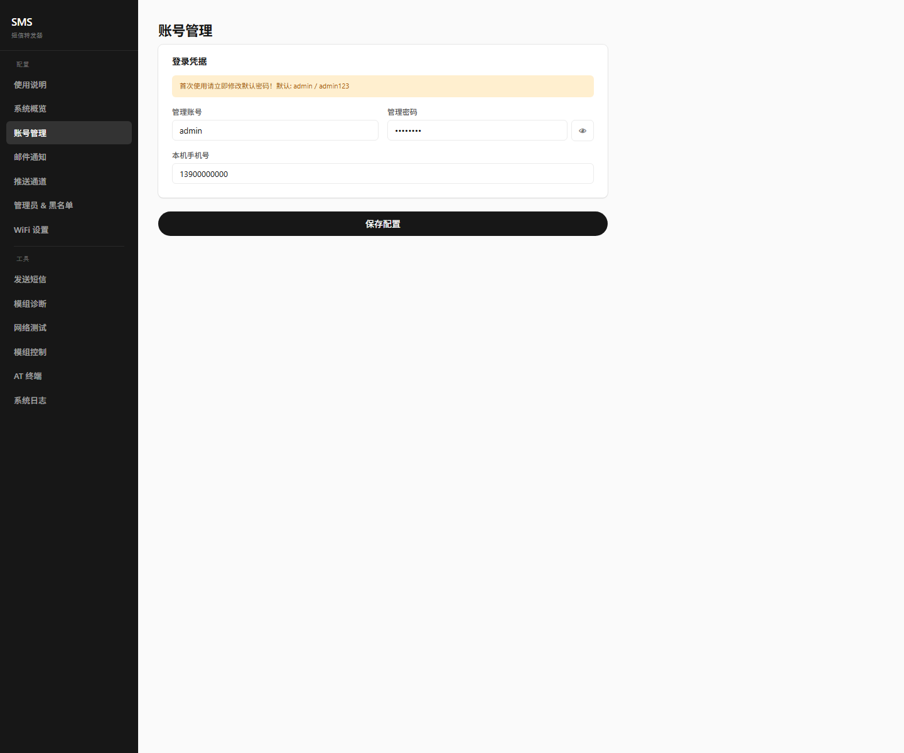

### 邮件通知

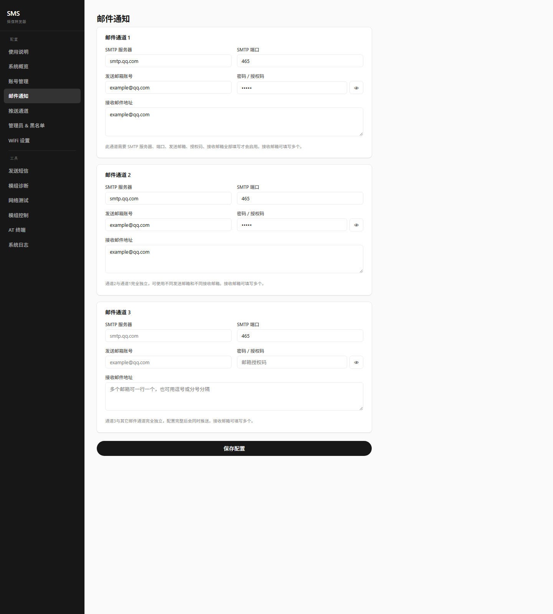

### 推送通道

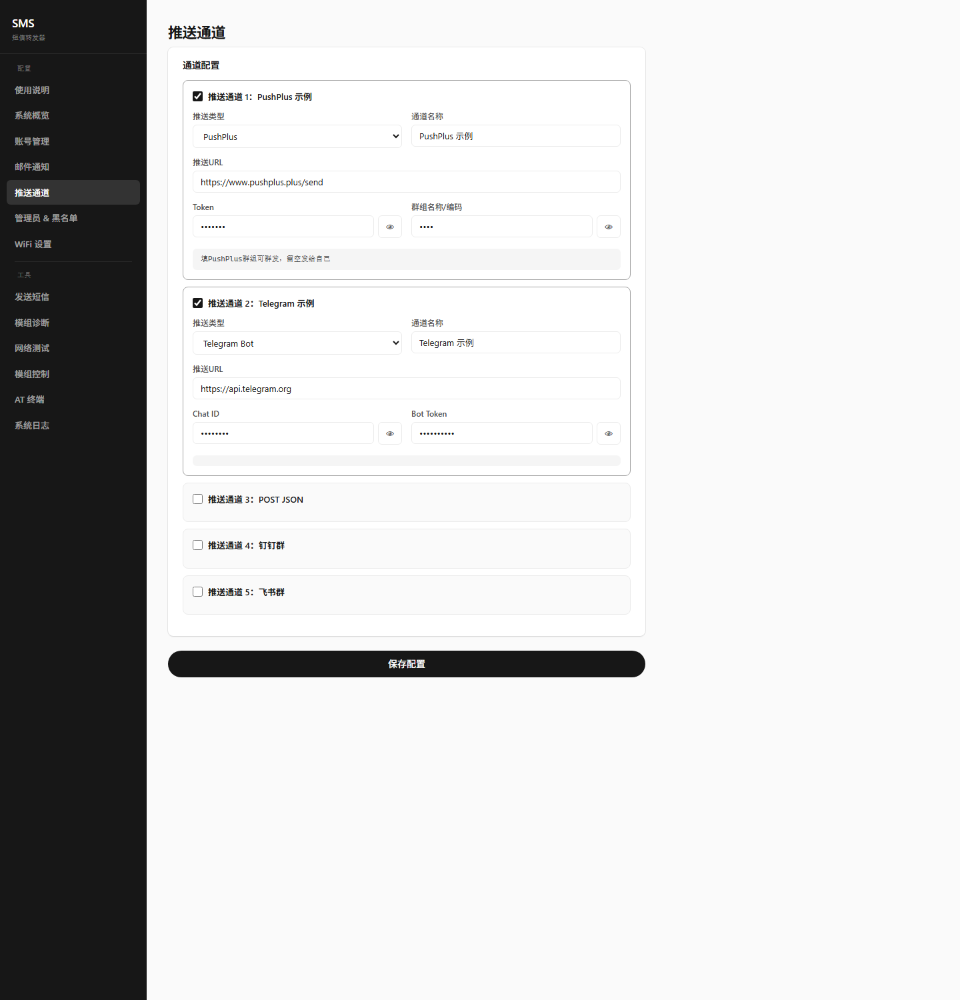

### 管理员 & 黑名单

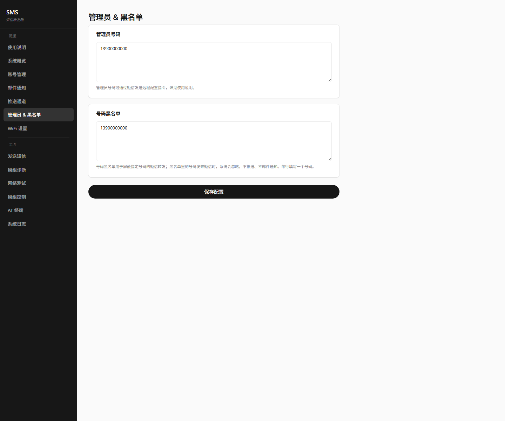

### WiFi 设置

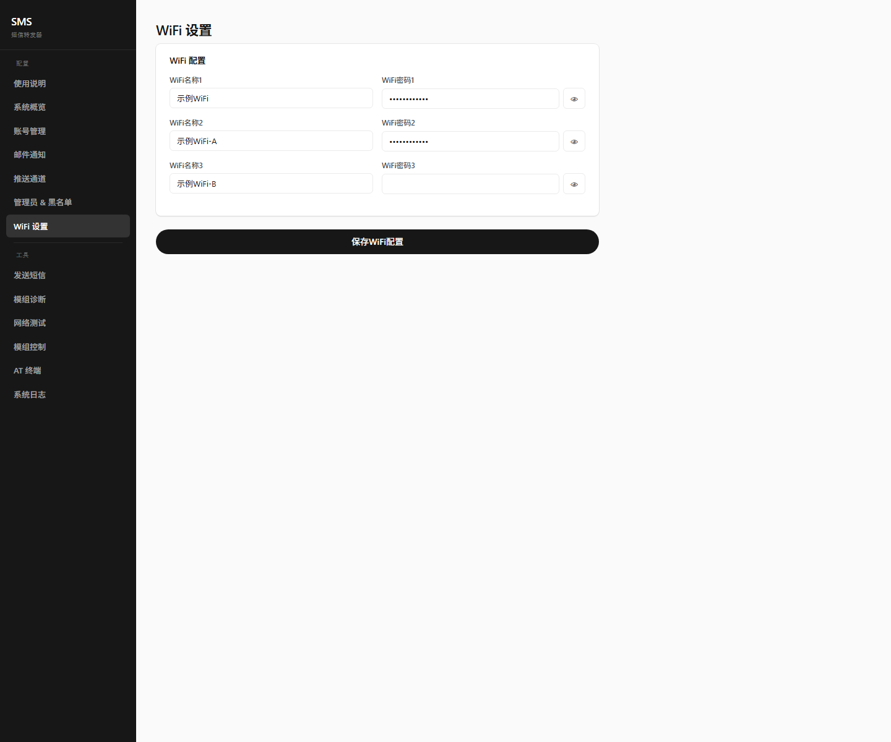

### 工具菜单

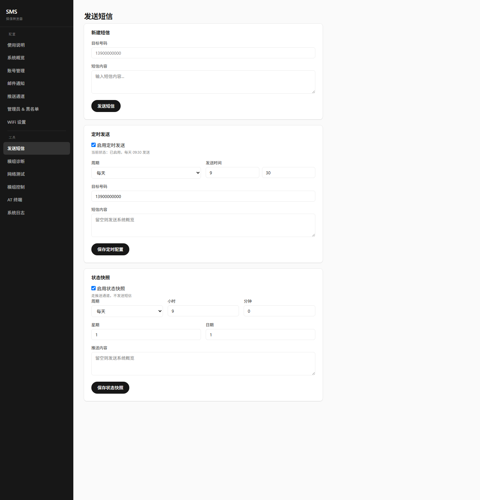

### 发送短信


### 模组诊断

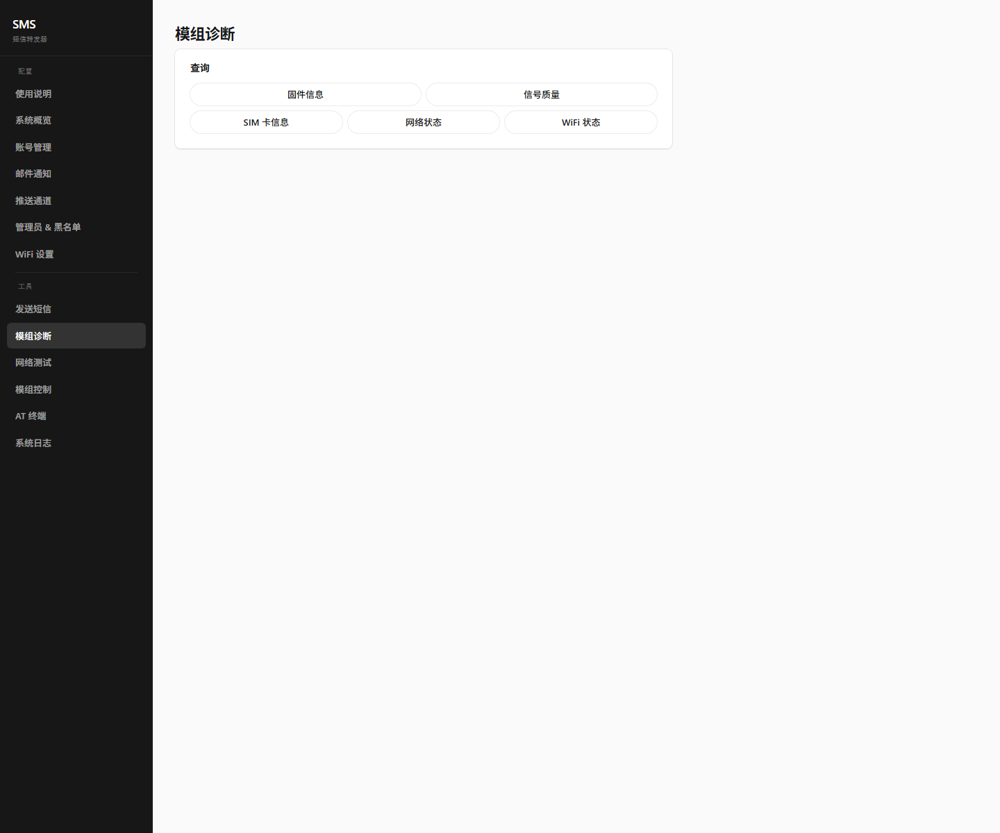

### 网络测试

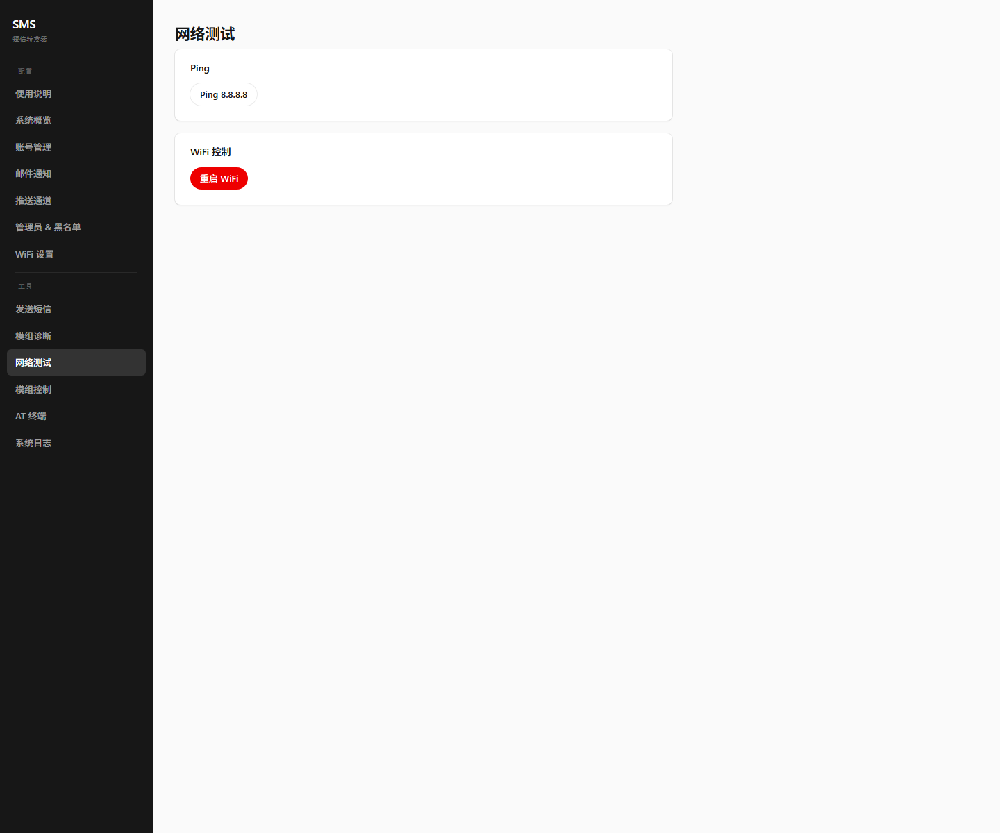

### 模组控制

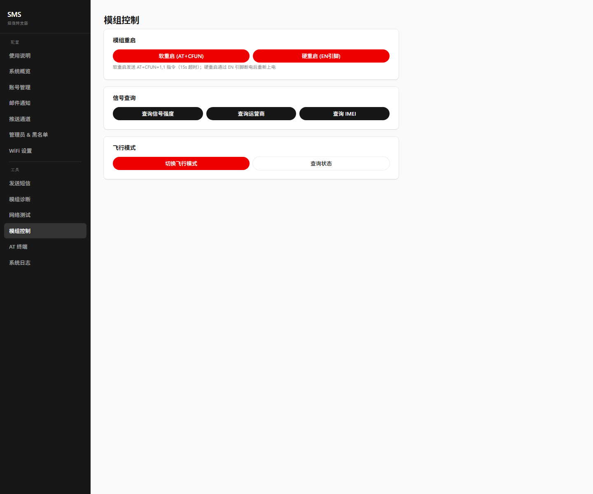

### AT 终端

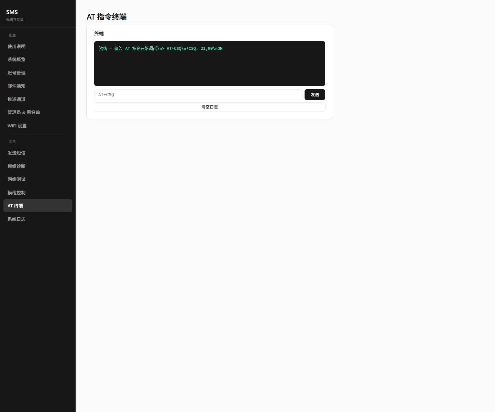

### 系统日志

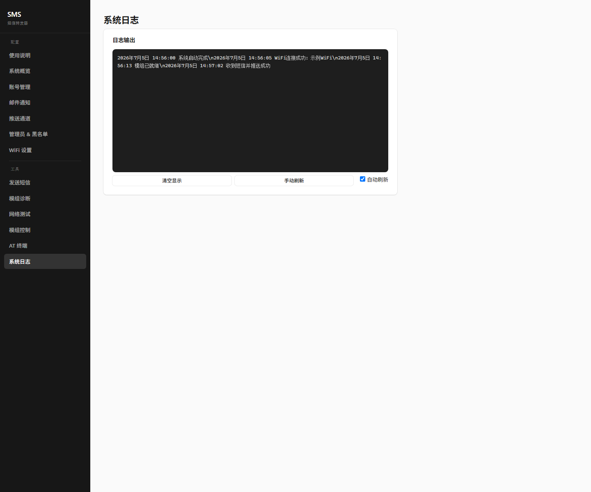
